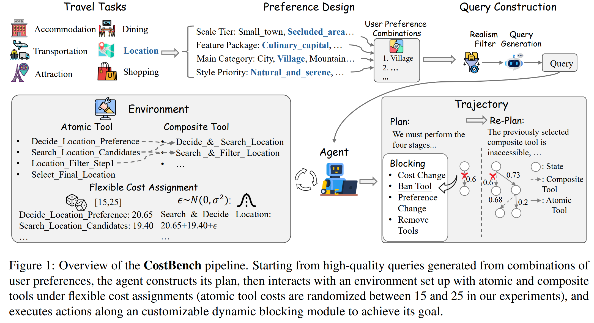
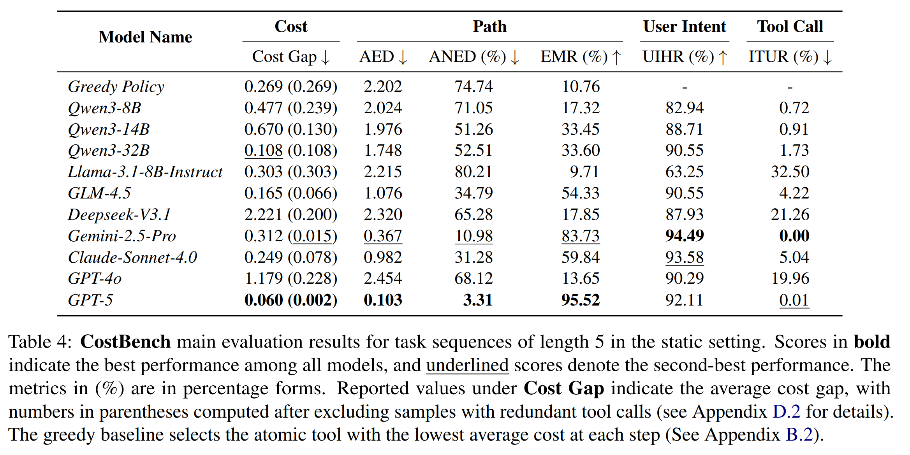

# CostBench



<p align="center">
  <a href="https://arxiv.org/pdf/2511.02734v1">📄 Paper</a> •
  <a href="https://github.com/JiayuJeff/CostBench/blob/main/env/data/runtime/queries/queries.json">📊 Dataset</a>
</p>

This is the official repository for paper "UserBench: An Interactive Gym Environment for User-Centric Agents".

## 🎯 Project Overview

**CostBench** is a comprehensive benchmark for evaluating **multi-turn cost-optimal planning and adaptation** capabilities of large language models (LLMs) in tool-using scenarios. 

The benchmark systematically assesses how LLM agents navigate complex tool-calling environments by testing their ability to:

- **📋 Cost-Optimal Planning**: Plan cost-optimal multi-step tool invocation sequences in static environments
- **🔄 Dynamic Adaptation**: Dynamically adapt their strategies when tool costs, availability, or preferences change during execution in dynamic environments

## ✨ Core Features

- **Hierarchical Tool System**: Supports atomic and composite tools, each with clear input/output types and costs
- **Flexible Cost Assignment**: Supports configurable cost ranges for atomic tools and composite tools with component-based cost calculation plus Gaussian noise, enabling customizable cost distributions for evaluation scenarios
- **Dynamic Blocking**: Supports multiple blocking modes (cost changes, preference changes, tool disabling, etc.) to test model adaptation capabilities
- **Adjustable Difficulties**: Supports different levels of task sequence to control task complexity
- **Reproducible Random System**: Features a seed-controlled pseudo-random system that ensures reproducibility across runs while preventing data leakage through deterministic randomization

## 🚀 Quick Start

### Installation

```bash
# Clone the repository
git clone https://github.com/JiayuJeff/CostBench.git
cd CostBench

# Install the package in editable mode
pip install -e .

# Or install dependencies only
pip install -r requirements.txt
```

### Environment Configuration

1. **Local Model Deployment**

   Replace `<your_base_url>` in the `model.endpoints` field of `env/config/travel_config.yaml` with your own port.

2. **API Calls**

   Replace `<your_api_key_env>` and `<your_base_url>` in the `endpoints.base_url` field of `env/config/travel_config.yaml` with your own API key environment variable name and port.
   
   Then, configure your API key in `env/.env`:
```bash
# Example configuration
OPENAI_API_KEY=your_api_key_here
OPENAI_BASE_URL=https://api.openai.com/v1
```

3. Check and modify the configuration in `env/config/travel_config.yaml` (if needed).

### Running Examples

#### Main Results



Basic run command (Table 4 results):

```bash
python env/run.py \
    --refinement_level 2 \
    --ban_longest_tool \
    --model_name gpt-5 \
    --num_threads 10 \
    --output_dir outputs/
```

Run with dynamic blockings (could change `cost_change` to other types):

```bash
python env/run.py \
    --refinement_level 2 \
    --ban_longest_tool \
    --model_name gpt-5 \
    --num_threads 10 \
    --use_blocker \
    --block_num 1 \
    --block_type cost_change \
    --output_dir outputs/
```

## 📖 Advanced Usage

For advanced configuration, please modify the [configuration file](env/config/travel_config.yaml) to customize tool parameters, blocking behavior, model endpoints, and other settings.

### Tool-Related Parameters

- `--tool_creation_seed`: Random seed for tool generation, controlling the tool creation seed and cost change batches for each query
- `--refinement_level`: Tool refinement level, controlling task complexity (defaults to maximum depth). For advanced usage, `task_sequence equals = refinement_level + 3'.
- `--max_tool_steps`: Maximum number of tool-calling steps
- `--min_atomic_cost` / `--max_atomic_cost`: Cost range for atomic tools
- `--noise_std`: Noise scaling factor for composite tools
- `--ban_longest_tool`: Whether to disable tools that complete the task in one step

### Blocking-Related Parameters

- `--use_blocker`: Enable dynamic blocking functionality
- `--block_mode`: Blocking mode (`preference_change`, `cost_change`, `steplen_change`, `ban_tool`)
- `--block_num`: Number of dynamic blocking events per query

### Query-Related Parameters

- `--query_path`: Path to query file (JSON format)
- `--start_index` / `--end_index`: Index range of queries to process (-1 means process all remaining queries)

### Model-Related Parameters

- `--model_name`: Model name (must be defined in configuration file)
- `--temperature`: Sampling temperature
- `--max_tokens`: Maximum number of generated tokens

### Runtime Parameters

- `--num_threads`: Number of concurrent threads
- `--output_dir`: Output directory for results
- `--require_goal_state`: Still in construction. Unexpected behavior may happen if set to true.

### Simulation-Related Parameters

- `--use_stimulation`: Enable random strategy simulation
- `--stimulation_num`: Number of simulation runs per query
- `--greedy`: Use greedy selection strategy in simulation. Would use random policy if set to False.

You can specify a custom configuration file path through the `COSTBENCH_TRAVEL_CONFIG` environment variable.


## 🔧 Extending to New Domains or Larger Task Sequences

Still in construction.

## 🤝 Contributing

Contributions are welcome! Please feel free to submit Issues and Pull Requests.

## 📚 Citing this work

```
@misc{liu2025costbenchevaluatingmultiturncostoptimal,
      title={CostBench: Evaluating Multi-Turn Cost-Optimal Planning and Adaptation in Dynamic Environments for LLM Tool-Use Agents}, 
      author={Jiayu Liu and Cheng Qian and Zhaochen Su and Qing Zong and Shijue Huang and Bingxiang He and Yi R. Fung},
      year={2025},
      eprint={2511.02734},
      archivePrefix={arXiv},
      primaryClass={cs.AI},
      url={https://arxiv.org/abs/2511.02734}, 
}
'''
